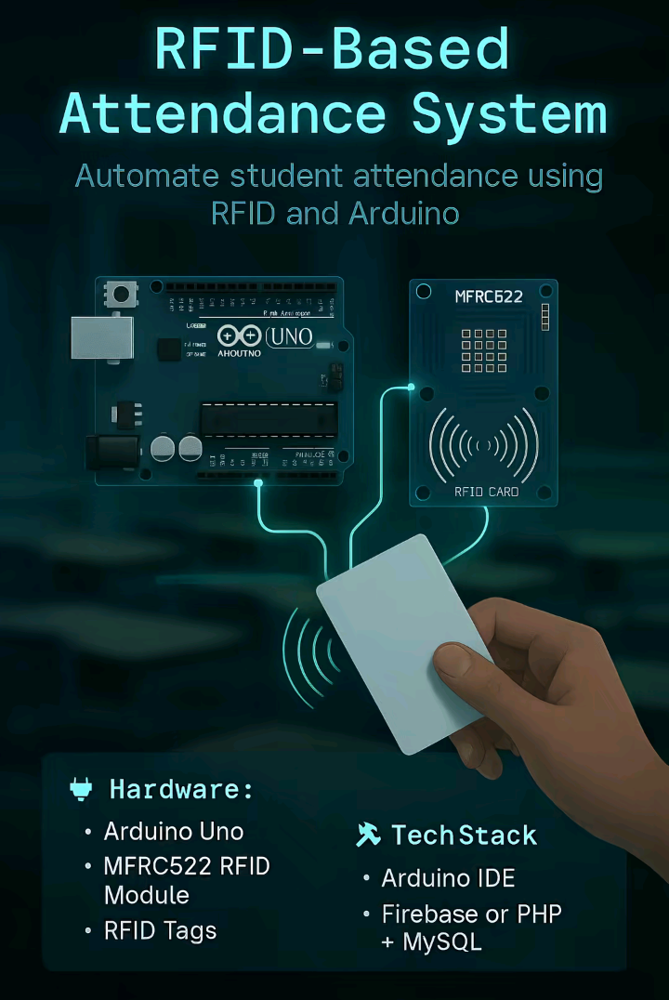

# 🚀 Capstone-Idea — Top 10 Arduino Projects by FluxDev-Tech

A curated collection of **Top 10 Arduino Capstone Projects** ideal for students, educators, and tech enthusiasts. Each project includes:

- 📷 Image preview  
- 🧠 Project description  
- 🛠️ Hardware & tech stack  
- 🧾 Sample Arduino code  

> _"Build smarter. Learn faster. Inspire others."_ – FluxDev-Tech

---

## 🔎 About This Project

This website presents **10 innovative Arduino-based projects** that are perfect for capstone or thesis work. Each project comes with a real image, live code snippet, and all necessary components listed.

Made for easy use, easy deploy — no frameworks, no external CSS, just clean HTML, CSS, and JS.

---

## 🔟 Project List

| # | Title |
|--|-------|
| 1 | RFID-Based Attendance System |
| 2 | Fingerprint Voting System |
| 3 | Theft Detection with SMS Alert |
| 4 | Wireless Notice Board |
| 5 | Fire and Smoke Alarm System |
| 6 | Smart Irrigation System |
| 7 | Home Automation with Mobile App |
| 8 | Alcohol Detection for Driver Safety |
| 9 | Smart Trash Bin (Auto Lid) |
| 10 | Fingerprint Door Lock System |

Each project shows:
- ✅ Real hardware components
- ✅ Full working Arduino code
- ✅ Tech stack used

---

## 🖼️ Preview Screenshot



> Replace with your actual screenshots or project thumbnails

---

## 📁 Project Structure

```
Capstone-Idea/
├── assets/
│   └── img/
│       ├── 1.png → RFID Attendance
│       ├── 2.png → Fingerprint Voting
│       └── ... up to 10.png
├── index.html     → All-in-one page (HTML + CSS + JS)
├── readme.html    → Web version of this README (optional)
└── README.md      → You're reading it
```

---

## ⚙️ How to Use

1. **Clone the repository**
   ```bash
   git clone https://github.com/FluxDev-Tech/Capstone-Idea.git
   cd Capstone-Idea
   ```

2. **Add project images** to `/assets/img/`  
   Filenames must be: `1.png`, `2.png`, ..., `10.png`

3. **Open `index.html`** in any browser

4. (Optional) Host online via:
   - [Vercel](https://vercel.com/)
   - [GitHub Pages](https://pages.github.com/)

---

## ✨ Features

- 📦 One-page layout
- 📱 Mobile-responsive grid
- 🧾 Embedded code viewer
- 💡 Click-to-expand project modal
- 💯 Zero frameworks — pure HTML + CSS + JS

---

## 🧰 Tech Stack

- HTML5  
- CSS3  
- JavaScript (ES6)  
- Arduino IDE (for hardware code)

---

## 🌐 Deployment Example

Once deployed, it looks like this:

```
https://yourname.github.io/Capstone-Idea
```

Or

```
https://capstone-idea.vercel.app/
```

---

## 🧑‍💻 Contributions

Pull requests are welcome!

- Add more projects  
- Improve UI  
- Share your hardware build photos  

---

## 📜 License

Licensed under the [MIT License](LICENSE).  
You may use, copy, and modify with attribution.

---

## 🙌 Author

Made with ❤️ by [FluxDev-Tech](https://github.com/FluxDev-Tech)

Follow for more tech + Arduino content!


