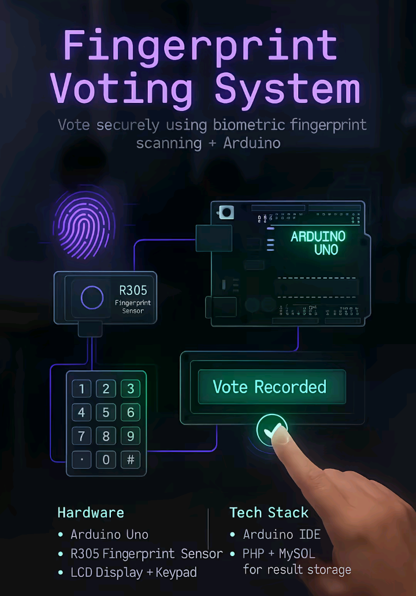
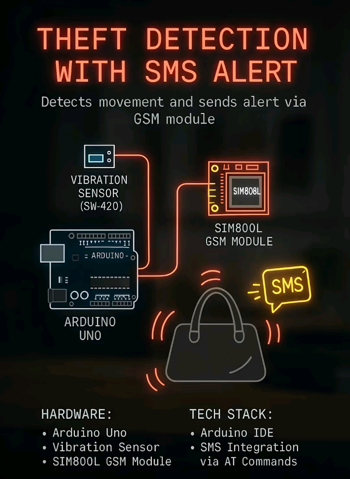
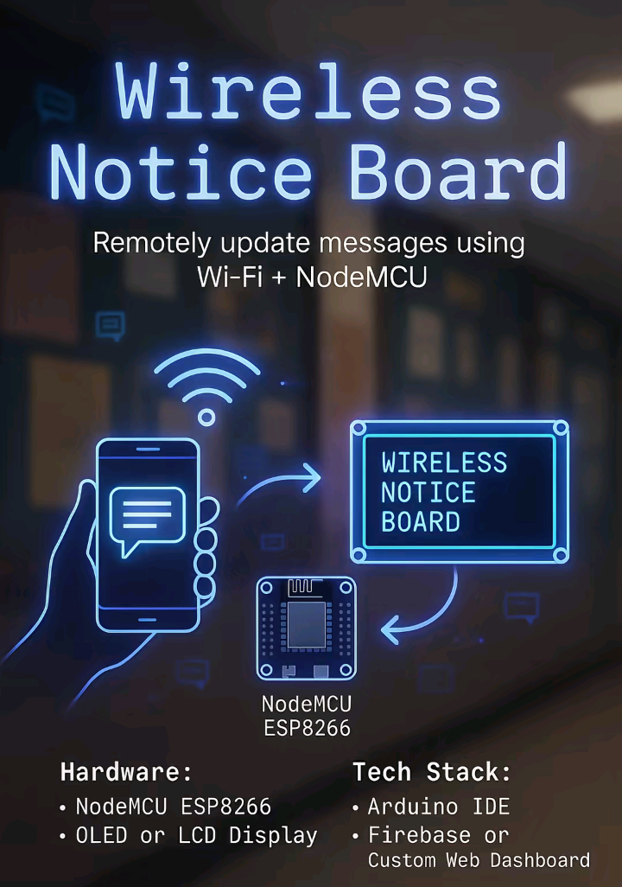
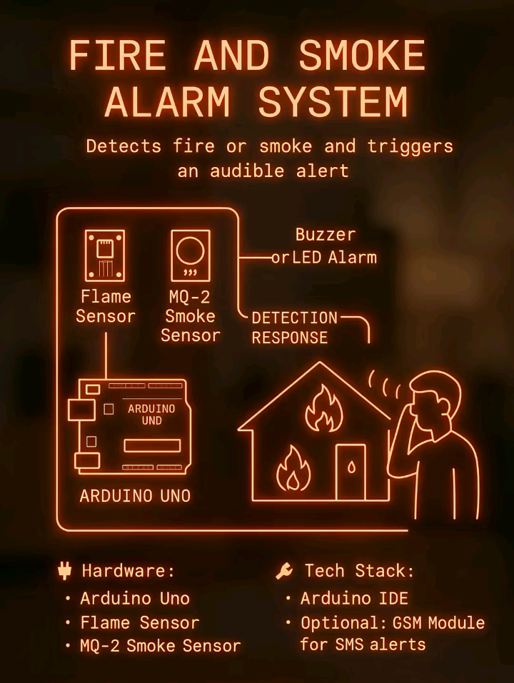
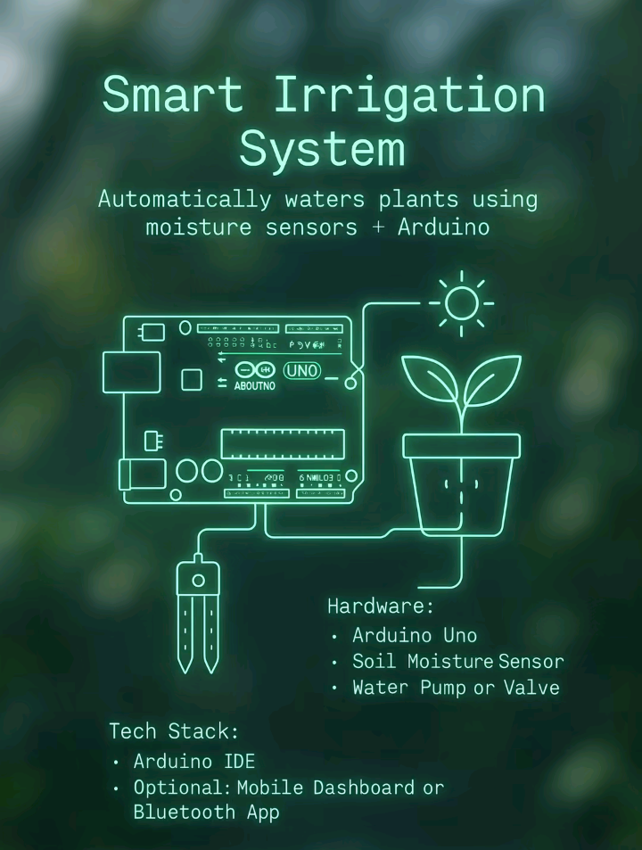
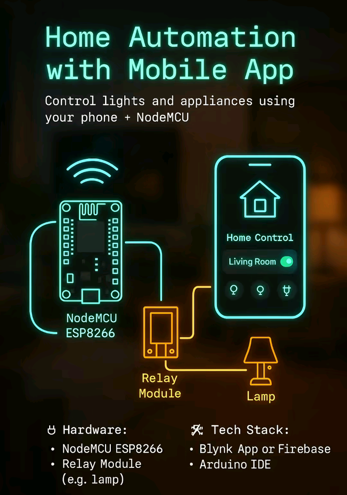
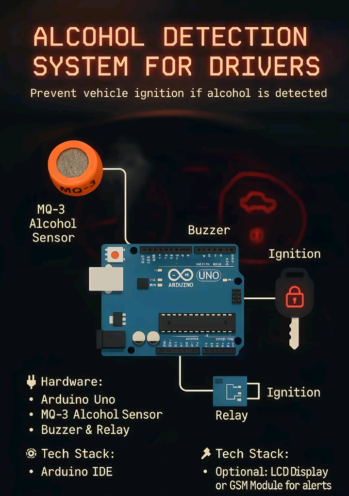
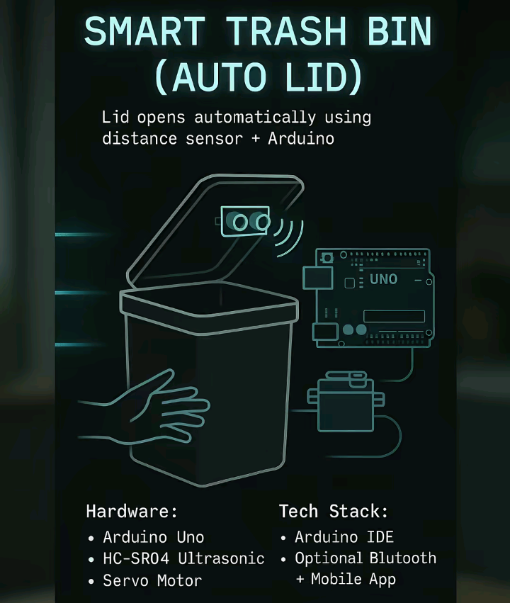
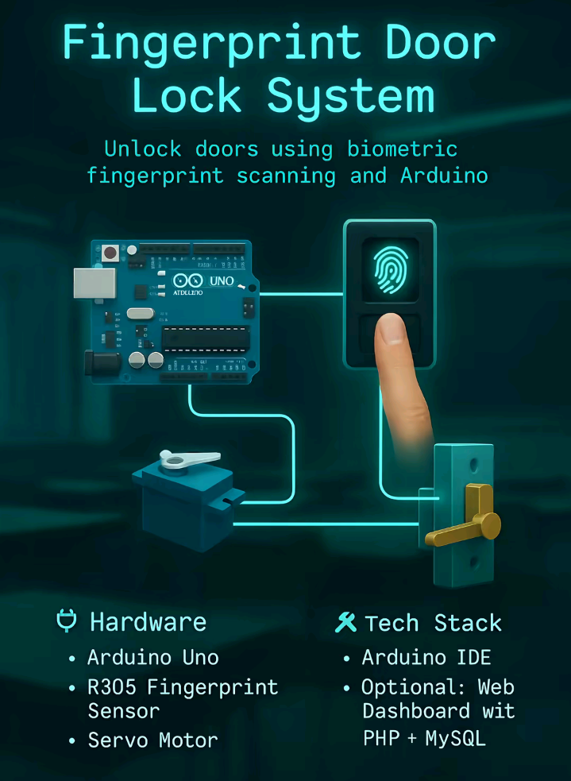

# 🚀 Capstone-Idea — Top 10 Arduino Projects by FluxDev-Tech

A beautiful, mobile-friendly, and fully interactive collection of **Top 10 Arduino Capstone Projects** — built for students, educators, and hobbyists looking for real-world innovation.

> _"Build smarter. Learn faster. Inspire others."_ — **FluxDev-Tech**

---

## 🔍 Overview

**Capstone-Idea** is a single-page website that showcases 10 Arduino-based project samples. Each project includes:

- 📸 Visual Project Preview  
- 🧠 Real-World Concept  
- 🛠️ Hardware Requirements  
- 💡 Tech Stack Overview  
- 🧾 Sample Arduino Code  

The site is responsive, fast, and doesn’t use any frameworks — built only with **HTML5**, **CSS3**, and **JavaScript**.

---

## 🔟 Included Projects

| #  | Project Title                          | Focus Area             |
|----|----------------------------------------|-------------------------|
| 1  | Smart Plant Monitor                    | Agriculture / IoT       |
| 2  | RFID Attendance Logger                 | Security / Automation   |
| 3  | Bluetooth Home Automation              | Home Control            |
| 4  | Touchless Hand Sanitizer               | COVID/Health Safety     |
| 5  | Digital Keypad Security System         | Access Control          |
| 6  | Fire Detection Alarm System            | Safety / Sensors        |
| 7  | Ultrasonic Water Level Monitor         | Monitoring / Sensors    |
| 8  | Smart Trash Bin with Auto Lid          | Waste Management        |
| 9  | Weather Monitoring Station             | Environmental IoT       |
| 10 | Traffic Light Simulation               | Transportation / Logic  |

Each card includes full details and expandable content.

---


## 📁 Project Structure

```
Capstone-Idea/
├── assets/
│   └── img/
│       ├── 1.png
│       ├── 2.png
│       └── ... up to 10.png
├── index.html     → Main HTML structure
├── styles.css     → CSS styles and responsiveness
├── script.js      → JavaScript interaction logic
├── projects.js    → Array of 10 project objects
└── README.md      → This documentation
```

---

## 💡 How It Works

- ✅ Projects stored in `projects.js` as an array of objects
- ✅ `script.js` dynamically generates the gallery
- ✅ Clicking a card reveals full project data
- ✅ Image previews + sample Arduino code included
- ✅ Horizontal scroll gallery for desktop, vertical fallback on mobile

---

## 📲 Responsive Design

Tested on:

- ✅ Phones (Android/iOS)
- ✅ Tablets
- ✅ Desktop / Laptops

Layout adapts to all screen sizes using pure CSS media queries.

---

## ⚙️ How to Use Locally

### 1. Clone the Repository

```bash
https://github.com/FluxDev-Tech/Capstone-Idea.git
cd Capstone-Idea
```

### 2. Screenshots












### 3. Run the Site

Just open `index.html` in any browser.  
No server required. No build tools.

---

## 🌐 Deploy Online

### Recommended Platforms

- [Vercel](https://vercel.com) (Fastest setup)
- [GitHub Pages](https://pages.github.com)

### Example Live Links

```
https://capstone-idea.vercel.app/
```
or
```
https://fluxdev-tech.github.io/Capstone-Idea/
```

---

## ✨ Features

| Feature                      | Description                            |
|-----------------------------|----------------------------------------|
| 🎯 One-page layout           | All content on one clean scrollable page |
| 🎨 Clean UI/UX               | Glow accents, dark mode ready          |
| 📱 Responsive Design         | Works great on mobile & desktop        |
| ⚙️ Hardware + Code Samples    | Preview parts and ready-to-run Arduino code |
| 🔄 Project Modal             | View full project info in click popup  |
| 🚫 No frameworks             | Pure HTML + CSS + JavaScript           |

---

## 🛠 Tech Stack

- HTML5 for markup  
- CSS3 for styles  
- JavaScript (ES6+) for interactivity  
- Arduino IDE for embedded code development

---

## 🙌 Contributions

We welcome contributions!

### You Can:

- 🧠 Add new projects  
- 🌐 Translate the interface  
- 📸 Submit project photos  
- 💄 Improve styling  

### To Contribute

```bash
# Fork the project
git clone https://github.com/FluxDev-Tech/Capstone-Idea.git
cd Capstone-Idea
# Create a feature branch
git checkout -b my-update
# Make changes, commit, and push
git commit -m "Added new capstone project idea"
git push origin my-update
# Submit a pull request
```

---

## 📜 License

This project is licensed under the **MIT License**.

You can use, modify, and distribute freely — with attribution.

---

## 👨‍💻 Author

**FluxDev-Tech**  
🛠 Arduino Enthusiast & Web Developer  
📬 fluxdev.tech@gmail.com  
🔗 [github.com/FluxDev-Tech](https://github.com/FluxDev-Tech)

> 💡 “Turn your Arduino project into a capstone that matters.”
